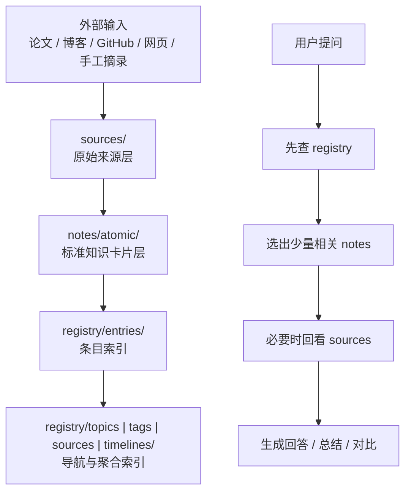

# LLM Knowledge Base

这是一个面向个人研究与长期积累的本地知识库。它的目标不是替代笔记软件，而是把论文、博客、GitHub 页面、网页文章、手工摘录等资料，沉淀成一套可以持续扩展、可追踪来源、适合被 LLM 使用的分层知识结构。

这个仓库既适合在本地用 VSCode 浏览，也适合同步到 GitHub 后通过网页阅读。对使用者来说，最重要的不是背命令，而是知道：

- 原文放在哪里
- 标准化后的知识卡片放在哪里
- 主题、标签、时间线索引放在哪里
- 提问时为什么不需要每次扫描整个知识库

## 这个知识库的核心思路

这个知识库采用 `sources -> notes -> registry` 的分层结构：

- `sources/` 保留原始来源，保证可回溯
- `notes/atomic/` 存标准化知识卡片，保证可阅读、可复用
- `registry/` 存轻量索引，保证检索时先缩小范围，再读取少量相关内容

这套设计的重点不是“把所有材料都堆在一起”，而是把知识分成不同职责的层。这样做的结果是：

- 人阅读时，优先看整理后的卡片，而不是直接翻原文
- 系统问答时，优先查索引，而不是扫描整个仓库
- 新内容入库时，可以持续增长而不容易失控

## 逻辑结构图



这张图对应两个关键原则：

1. 归档时先保存原文，再沉淀知识卡片，再更新索引  
2. 提问时先查索引，再读少量卡片，最后才按需回看原文

## 目录分层说明

下面这些目录是你真正需要理解的核心部分：

| 目录 | 作用 | 你什么时候看它 |
|---|---|---|
| `sources/` | 原始来源快照或附件 | 你要核对原文、回看出处时 |
| `notes/atomic/` | 单篇材料对应的一张标准知识卡片 | 你想真正阅读内容时 |
| `notes/syntheses/` | 跨多篇材料的综合总结 | 你想看阶段性总结时 |
| `notes/topics/` | 长期维护的主题页 | 你想看某一主题的知识地图时 |
| `registry/entries/` | 每条知识的轻量索引入口 | 系统检索和 `trace` 时 |
| `registry/topics/` | 按主题聚合的导航页 | 你按主题浏览时 |
| `registry/tags/` | 按标签聚合的导航页 | 你按标签浏览时 |
| `registry/sources/` | 按来源类型聚合 | 你想看 arXiv / web / GitHub 等来源时 |
| `registry/timelines/` | 按年份或时间维度聚合 | 你想追踪演化脉络时 |
| `inbox/` | 临时输入与待处理区 | 一般不需要日常浏览 |

## 你平时应该看哪里

如果你只是“使用这个知识库”，最常看的通常只有下面 3 层：

### 1. 读内容：看 `notes/atomic/`

这里是最适合人读的内容层。每篇归档材料最终都会变成一张标准卡片，通常包含：

- 摘要
- 核心观点
- 证据或来源
- 相关性
- 你的思考和后续问题

比如当前已有条目：

- [blog-2026-04-forge-scalable-agent-rl-framework-and-algorithm.md](notes/atomic/blog-2026-04-forge-scalable-agent-rl-framework-and-algorithm.md)
- [paper-2026-04-scalable-training-of-mixture-of-experts-models-with-megatron-core.md](notes/atomic/paper-2026-04-scalable-training-of-mixture-of-experts-models-with-megatron-core.md)
- [paper-2026-04-relax-an-asynchronous-reinforcement-learning-engine-for-omni-modal-post-training-at-scale.md](notes/atomic/paper-2026-04-relax-an-asynchronous-reinforcement-learning-engine-for-omni-modal-post-training-at-scale.md)

### 2. 按主题逛：看 `registry/topics/` 和 `registry/tags/`

如果你不是想读某一篇，而是想按方向浏览，就看索引页：

- [registry/topics/post-training.md](registry/topics/post-training.md)
- [registry/topics/training-systems.md](registry/topics/training-systems.md)
- [registry/topics/moe.md](registry/topics/moe.md)
- [registry/tags/reinforcement-learning.md](registry/tags/reinforcement-learning.md)

这些页面更像“导航页”，不承担全部知识内容，而是负责告诉你：

- 这个主题下有哪些条目
- 哪些条目值得先看
- 某一篇条目属于哪些主题和标签

### 3. 查出处：看 `sources/` 或用 `trace`

如果你想核对原文，不要只看知识卡片，应该回到来源层：

- `sources/papers/` 放论文 HTML/PDF 等原始来源
- `sources/blogs/` 放博客快照
- `sources/social/` 放社交平台内容快照
- `sources/github/` 放仓库相关材料

你也可以直接用：

```bash
PYTHONPATH=./_vendor python -m llm_kb trace --root . --id <entry_id>
```

它会告诉你这条知识卡片对应哪个正式卡片、哪些来源文件。

## 一次归档后会生成什么

一条内容归档后，通常不是只生成一个文件，而是一组文件：

| 文件类型 | 目录 | 作用 |
|---|---|---|
| 正式知识卡片 | `notes/atomic/` | 人阅读的主内容 |
| 正式索引条目 | `registry/entries/` | 检索与追踪入口 |
| 正式来源文件 | `sources/` | 原文快照或附件 |
| 主题索引 | `registry/topics/` | 按主题聚合 |
| 标签索引 | `registry/tags/` | 按标签聚合 |
| 来源索引 | `registry/sources/` | 按来源类型聚合 |
| 时间线索引 | `registry/timelines/` | 按时间聚合 |

如果你显式使用 `--review`，还会临时生成：

- `inbox/pending/drafts/`
- `inbox/pending/sources/`

它们表示“待确认中间态”，不是正式知识层。

## 如何使用这个知识库

### 方式一：本地用 VSCode 看

这是最推荐的日常使用方式：

1. 打开仓库根目录  
2. 先读 `README.md`  
3. 想看具体内容就进 `notes/atomic/`  
4. 想按主题浏览就进 `registry/topics/`  
5. 想核对出处就进 `sources/`

如果你主要是自己用，这已经足够。

### 方式二：同步到 GitHub 后网页看

同步到 GitHub 后，`README.md` 会是最适合的入口页。GitHub 更适合：

- 浏览结构
- 点开卡片
- 点主题索引
- 分享知识条目链接

这也是为什么 README 需要写成“知识库首页”，而不是只写命令帮助。

## 如何归档新内容

当前支持 3 类输入：

- 本地文件
- 纯文本
- URL

最常用命令是：

```bash
python -m llm_kb init --root .
python -m llm_kb ingest-file --root . --source ./paper.pdf --title "Demo Paper" --type paper --source-kind arxiv
python -m llm_kb ingest-text --root . --text "..." --title "Demo Note" --type note --source-kind manual
python -m llm_kb ingest-url --root . --url "https://example.com" --title "Demo URL" --type blog --source-kind web
```

如果你想手动保留一个“待确认草稿”流程，可以显式加：

```bash
python -m llm_kb ingest-url --root . --url "https://example.com" --title "Example" --type blog --source-kind web --review
```

这时可以继续使用：

- `review-draft`
- `confirm-draft`
- `revise-draft`
- `cancel-draft`

## 如何提问

当前最直接的两个入口是：

```bash
python -m llm_kb ask --root . --query "post-training"
python -m llm_kb trace --root . --id paper-2026-04-example
```

它们各自负责：

- `ask`：先从索引层找最相关的条目
- `trace`：把条目映射回知识卡片和原始来源

## 为什么提问不需要访问整个知识库

这是这个知识库最重要的设计点之一。

它并不是“把所有 Markdown 全喂给模型”那种工作方式，而是走一条更省 token 的路径：

### 第一步：先查 `registry`

系统先看轻量索引：

- `registry/entries/`
- `registry/topics/`
- `registry/tags/`
- `registry/timelines/`

这一层文件很短，适合快速筛选候选条目。

### 第二步：再读少量 `notes`

从索引里筛出最相关的少量条目后，再去读对应的 `notes/atomic/` 卡片，而不是读全部卡片。

这一步通常只需要读 3 到 8 篇相关卡片，而不是整个知识库。

### 第三步：必要时才回看 `sources`

只有当你需要：

- 看原文证据
- 校对细节
- 查精确出处

才回到 `sources/`。

### 这样做的好处

| 做法 | 成本 | 结果 |
|---|---|---|
| 扫整个知识库 | token 高、速度慢、噪音多 | 容易把无关信息也带进来 |
| 先查 `registry` 再读相关 `notes` | token 低、范围小、逻辑清楚 | 更适合长期扩展 |

所以这个仓库的使用方式本质上是：

`索引优先，而不是全文优先`

## 一个推荐的日常工作流

### 场景 1：刚读完一篇论文，想收进去

1. 用 `ingest-file` 或 `ingest-url` 归档
2. 查看生成的 `notes/atomic/` 卡片
3. 确认它是否被挂到了合适的 `topic/tag`

### 场景 2：我想看某个方向积累了什么

1. 先看 `registry/topics/<topic>.md`
2. 再点进相关 `notes/atomic/*.md`
3. 必要时回看 `sources/`

### 场景 3：我想让 LLM 基于知识库回答一个问题

推荐让它按下面顺序工作：

1. 先查 `registry`
2. 只读少量相关 `notes`
3. 只在必要时读 `sources`
4. 回答时区分“卡片总结”和“原文依据”

## 命令入口

如果你想看命令帮助：

```bash
PYTHONPATH=./_vendor python -m llm_kb --help
PYTHONPATH=./_vendor python -m llm_kb ask --help
PYTHONPATH=./_vendor python -m llm_kb trace --help
```

更细的 CLI 使用细节可以继续看：

- [docs/usage.md](docs/usage.md)

## 当前版本明确不做什么

这个版本刻意不做这些事情：

- 不做向量数据库
- 不做 embedding 检索
- 不做在线服务
- 不做复杂权限系统
- 不做自动高质量综述生成

它优先保证的是：

- 文件结构清楚
- 来源可回溯
- 知识可标准化
- 检索有层次
- 随着内容增加，问答仍然能控制 token 成本
